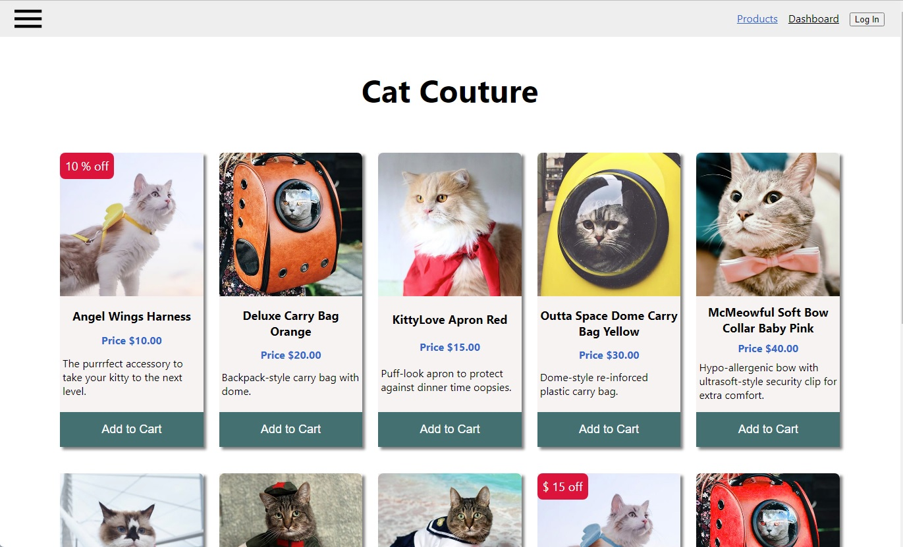
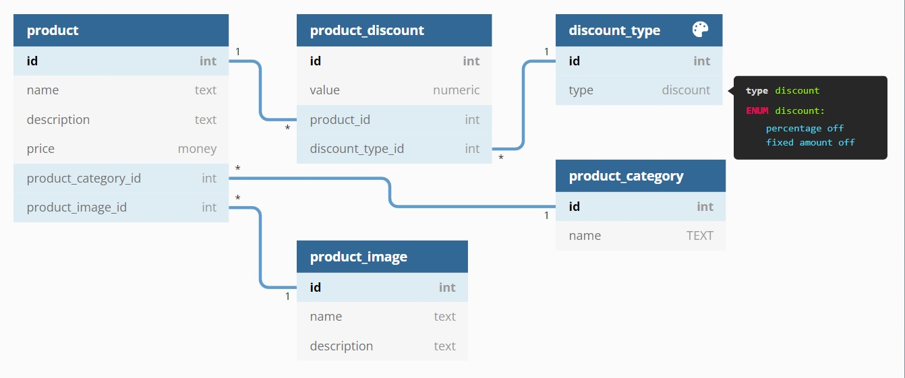

# Cat Couture - A Mock Online Store-Front

<!-- PROJECT LOGO -->
<br />
<p align="center">
  <a href="">
    
  </a>

  <h3 align="center">Cat Couture</h3>

  <p align="center">
    A Mock Online Store-Front Application
    <br />
    <br />
    <br />
  </p>
</p>

<!-- TABLE OF CONTENTS -->
<details open="open">
  <summary>Table of Contents</summary>
  <ol>
    <li><a href="#overview">Overview</a></li>
    <li><a href="#built-with">Built With</a></li>
    <li><a href="#architecture-diagram">Architecture Diagram</a></li>
    <li><a href="#getting-started">Getting Started</a></li>
    <li><a href="#database-diagram">Database Diagram</a></li>
    <li><a href="#content-access">Content Access</a></li>
    <li><a href="#api-specification">API Specification</a></li>
    <li><a href="#view-the-application">View The Application</a></li>

  </ol>
</details>

---

## Overview

Cat Couture is an online shop that specializes in the latest cat fashion. It has:

- A pagination feature, so that their customers can better view and link to the increasing variety of costumes that the shop now stocks
- An area of the site where their administrator can to log in and:
  - See the number of cat costumes in each product category that the shop sells
  - See the number of different products that are on promotion

This is a client-server application with product data stored in a PostgreSQL database and Authorisation/Authentication provided by Auth0

### Built With

Key frameworks and technologies used in this project are:

- [Javascript / CSS / HTML](https://developer.mozilla.org) - Relevant to client and server components
- [React](https://reactjs.org/) - Main Client Application Code Base
- [Node](https://nodejs.org/) - Server Javascript application enviornment
- [Express](http://expressjs.com/) - Fast, unopinionated, minimalist web framework for Node.js
- [PostgreSQl](https://www.postgresql.org/) - A powerful, open source object-relational database system
- [Jest](https://jestjs.io/) - Testing enviornment
- [SuperTest](https://www.npmjs.com/package/supertest) - High-level abstraction for testing HTTP
- [Netlify](https://www.netlify.com/) - Web Site public hosting service
- [Auth0](https://auth0.com/) - An easy to implement, adaptable authentication and authorization platform.

---

## Architecture Diagram


---

## Getting Started

**To run the app:**

```zsh
docker-compose up --build
```

**To run the server-side tests:**

```zsh
docker-compose -f docker-compose.test.yml up --build
```

**To run the client-side tests:**

```zsh
cd client
npm install
npm test
```

---

### Database Diagram



---

## Content Access

Only a logged in user who has `read:reports` permission can access the Dashboard page reports.

---

### API Specification

The application API conforms to Open API Specification 3.0.1
The API specification can be viewed in the test environment at: http://localhost:5001/
The API specification can be viewed in the production environment at: https://warricksmith.com/catcoutureapi/

---

### View The Application

The application has been deployed in production to: https://warricksmith.com/catcouture

---
